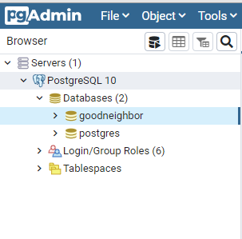
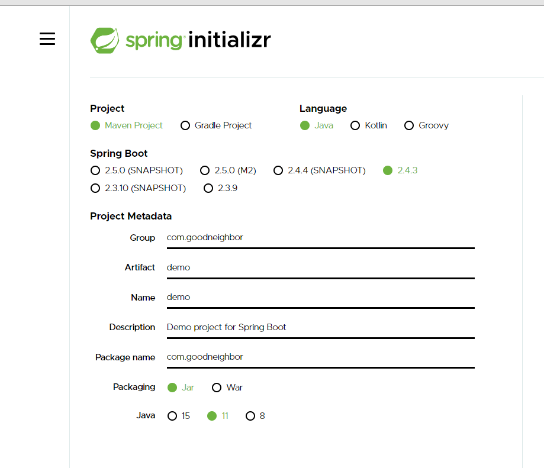
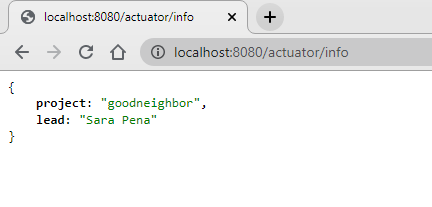
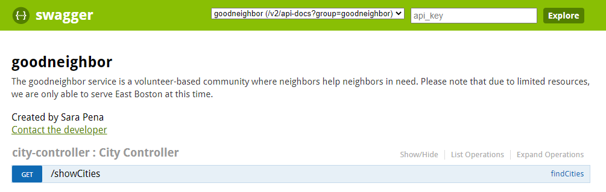

<h5>The goodneighbor backend service is a volunteer-based community where neighbors help neighbors in need</h5>

## POSTGRESSQL INITIAL SET UP

  

## SPRING BOOT INITIAL SET UP

https://start.spring.io/

  

-   Installation command >> gn-backend>mvn clean install package -DskipTests

-   Run app command >> gn-backend>mvn spring-boot:run

## APP RENDERS IN BROWSER

  

http://localhost:8080/actuator/info

## SWAGGER CUSTOM API

  

http://localhost:8080/swagger-ui.html
